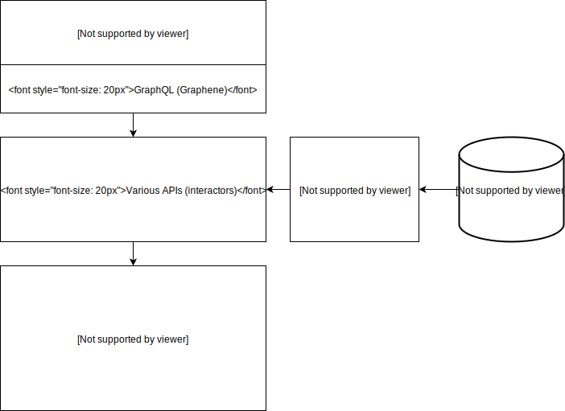

# What was built

We built a single page application with React as our front end and Flask as our backend.
We are communicating between the front and back ends of our application using GraphQL.

The features we have implemented so far are:
- User creation and authentication
- Creating and deleting courses
- Creating and deleting sections
- Frontend views
- CRUD operations for meetings (not connected to the front end yet)
- CRUD operations for comments on meetings (not connected to the front end yet)
- CRUD operations for notes on meeting (not connected to the front end yet)

# High level design

Our frontend is built with React. We made use of Apollo-Client to handle our GraphQL requests, and Bootstrap and FontAwesome to help with styles. We also imported a library for creating human-readable dates, called DateFormat. There is only one frontend for our application, but we have split it into views which are served up based on whether the user is a professor or a student. We keep a user object in App.js, and pass it down in props to every other page. That user object has a role field, which we check to determine which view to display.
    
Our backend is built with Python. It is a GraphQL API built on top of [Graphene](https://graphene-python.org/) served by [Flask](http://flask.pocoo.org/).
It is split into two parts: Instructor service and Student service.

We are following a [domain driven design](https://en.wikipedia.org/wiki/Domain-driven_design) + [ports and adapters](http://blog.cleancoder.com/uncle-bob/2012/08/13/the-clean-architecture.html) architecture, 
the reason for this approach is that each individual components is testable on its own, without depending on any other components. For example, 
in this fairly involved [test file](https://github.com/office-hour-scheduler/ohs/blob/master/backend/core/tests/graphql/test_course_mutations.py), we are able to mock out any classes that is not under testing.

The only data type that can cross boundaries in our application are domain objects, hence the "ports and adapters". (port can only accept domain objects, adapters converts layer local data to domain data).
This allows us to swap out any components of our application without affecting the other parts.

Another advantage of this design is that we are deferring all state to our persistence layer and keeping no state at all in our application. This means our application
is highly scaleable, with the database being its only bottleneck.

Below is a rough architecture diagram for our back end:

# Technical highlights

GraphQL was our team's main interest when we started this project, but its steep learning curve has proven to be somewhat troublesome in the actual implementation of our application.
Despite the slower progress in implementing features, we believe that learning GraphQL is very beneficial to us, since it is a very useful tool in a developer's tool belt.

In our backend, we are using the [Option](https://pypi.org/project/option/) library to represent None objects and exceptions. By using `Option` and `Result` types, in combination
with extensive usage of [type hinting](https://www.python.org/dev/peps/pep-0560/), we are able to write more type safe code than a typical Python program, at the cost of code being
too terse from time to time (Example: https://github.com/office-hour-scheduler/ohs/blob/master/backend/core/app.py#L103).

For user authentication, we are using a combination of username/password and JWT. A user would first log in with their username and password to obain a token, and use that token
to make authenticated requests to our GraphQL endpoint. (More details here: https://github.com/office-hour-scheduler/ohs/wiki/How-to-create-a-new-user-and-authenticate-for-GraphQL-access)
For the instructor service and student services, they are exposing a subset of our entire GraphQL schema to ensure a student cannot perform instructor actions, while still being
able to perform common actions shared between the two user types, and vice versa. Since the entire GraphQL end point required authenticated requests, we don't have to check
for user type in the actual query operations.

We are using docker-compose for deployment (compose file here: https://github.com/office-hour-scheduler/ohs/blob/master/docker-compose.yml), and our application is configured with
environment variables. docker-compose enables us to deploy and update all components of our application, including the database, with one command. And the use of environment
variables works nicely with docker, and simplfies reading configurations in actual code (No need to fight with file paths anymore)

Our frontend is a fairly standard react application. It was initialized using the create-react-app script. We are using Jest for unit testing frontend, but have fallen far behind on unit tests because we wanted to have some UI to actually show.

# Process

We are roughly following a Kanban development methodology, since it's not very realistic for us to have sprints. Our Kanban board can be found here: https://github.com/office-hour-scheduler/ohs/projects/1

We are using our [GitHub repo wiki](https://github.com/office-hour-scheduler/ohs/wiki) to note things that are useful for developers to reduce communication overhead.

We had one long meeting almost a week ago, where we planned out a lot of UI, and built a lot of our frontend tasks. Other than that, we have been communicating over slack or occasionally in class.

# Reflection

One major problem with our current collaboration process is that we have allowed a couple of our group members to fall behind, and now it is very difficult for them to start contributing. If we had regular meetings from the start - maybe following something closer to Scrum rather than Kanban - it would have probably helped us keep everybody up to date.

Our GitHub issues ended up being kind of useless, because we ended up splitting up into frontend and backend developers, but our GitHub issues captured an entire vertical slice. Because of this, we have fallen behind on updating the GitHub issue board, because a developer is very rarely able to complete an entire issue by themself. If we were to redo this, we would just split every issue into a frontend and backend component.

It also would have been better if we spent more time on the issues, so our success criteria were more clear. Especially on the frontend issues, we have left a lot of leeway for developers to make the design as they go. It would have been much faster if we set aside time to plan out the appearance of the UI in more detail up front, so that developers just need to implement the already created designs.

# Triage

Most of the backend has been created now. The last major component we still need to create is the office hour / time slot system. Right now meetings are just being associated with times - they do not require an existing time slot to be booked in. The following backend tasks which we outlined in our phase 1 scope.md still need to be completed:

Instructor:
- C / R / U / D Office Hours with each Section
- Split each Office Hour into Slots (automatic - no UI interaction)

Student:
- View office hour slots for lecture sections you are enrolled in (can see if they are booked)
- Book a slot for a meeting (don't have slots yet)

The following tasks were stated as low priority, and they still are low priority:
- Calender integration
- Reminders when a meeting is coming up/almost done
- “Sorry I’m Late” notification

On the frontend, we still have a lot of work to do. We have basically finished with the student and instructor dashboards, and the meeting view. We still need to create the meeting booking / view time slots page for students, and the page where you create office hours for instructors.

Also, we have fallen a bit behind on integrating the frontend with the backend. This was mostly because we spent a lot of time trying to figure out setting up the backend, then hurried the frontend a bit so we would have some UI to show for phase 2. We are successfully creating / viewing courses and lecture sections. Other than that, we still need to connect the frontend and backend.

Again, the goal of our group was largely to learn GraphQL, so we haven't been able to create as many features as we would have if we went with a system we were already familiar with. Despite this, we have completed a lot of the backend now, which was our largest challenge area for this project. Because of this, we still think we will be able to get all our high priority tasks completed for P3.
